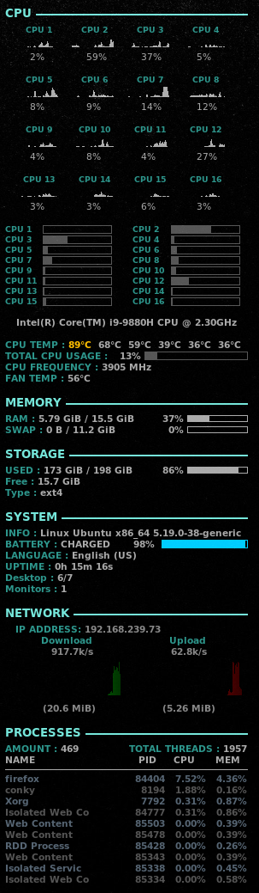

# About
This Conky Configs shows very beautiful configuration of conky at top left of your screen for Debian Linux Distribution
## Installation
First execute commands below in order to install conky
```
sudo apt update
sudo apt install conky-all
```
then run conky to initialize it and creating configuration file
```
conky
```
now copy all contents of conky file on this repo then paste it in conky's configuration file located at :
```
~/conkyrc
```
save and close and now you see new design of your conky
## Features
- Can be used for up to 16 cpu processors
- Colorful cpu usage graph for each usage stats (normal - warning - high)
- Top 10 processes status and usage
- Network usage graph with speed for both upload and download
- Wireless Connection IP
- Battery state
- Storage usage
- Memory usage

## Sample Image


## Please Star :D
